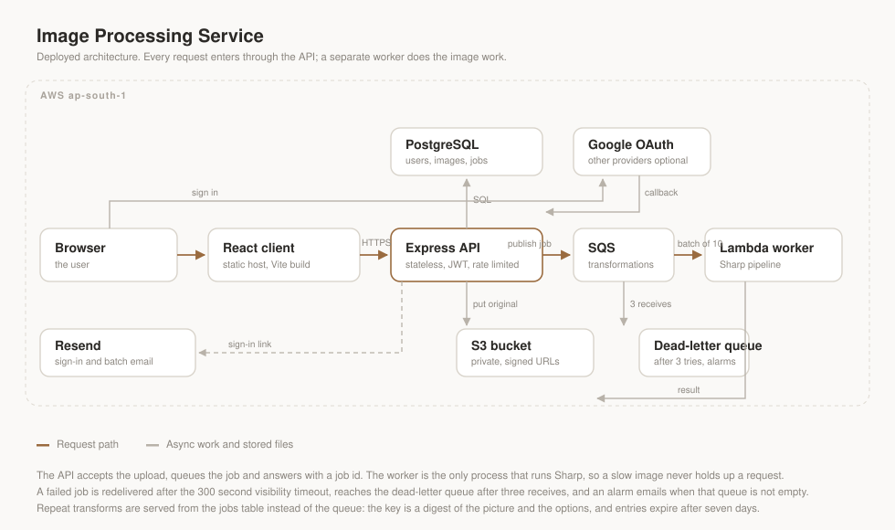

# Image Processing Service

Upload an image, pick some transformations, get the result back. Node.js, Express and TypeScript, with Sharp doing the image work. PostgreSQL holds the state, S3 holds the files, SQS carries the jobs.

## Architecture



Every request goes through the API. A separate worker does the image work, with the queue in between.

## Features

- Sign in with Google, Facebook, Twitter, or an emailed link. No passwords anywhere.
- Upload up to 10 MB per image, stored in a private S3 bucket.
- Transform pipeline: resize, crop, rotate, trim, pad, mirror, modulate, blur, sharpen, grayscale, sepia, watermark, format conversion.
- Repeat transforms are reused instead of redone. The key is a digest of the picture plus the options, and entries live for 7 days.
- Failed jobs retry, and move to a dead-letter queue after 3 attempts.
- Pre-signed URLs for every file, so the bucket itself stays private.
- One email when a batch finishes.
- Everything is scoped to the signed-in user.

## Running it locally

You need Node 20+, npm and Docker. No AWS account is needed for local work.

```bash
git clone https://github.com/Inline090/Lumina.git
cd Lumina
npm install
docker compose up -d
cp server/.env.example server/.env
```

The file you just made, `server/.env`, is gitignored and is the only file you need to fill in. Paste this block in:

```bash
# server/.env
JWT_SECRET=dev-only-secret-change-me

# the containers from docker-compose.yml. Remove these four lines to talk to real AWS.
AWS_ACCESS_KEY_ID=minioadmin
AWS_SECRET_ACCESS_KEY=minioadmin
S3_ENDPOINT=http://localhost:9000
SQS_ENDPOINT=http://localhost:9324
```

`JWT_SECRET` is the only value the app refuses to start without. Every other setting in `server/.env.example` already has a sensible default.

```bash
npm run migrate --workspace=server
npm run dev                        # api    -> localhost:3000
npm run worker --workspace=server  # worker -> reads the queue
npm run dev:client                 # client -> localhost:5173
```

The worker is not optional. Without it, jobs sit at `pending` forever.

Everything runs at: client `:5173`, API `:3000`, Postgres `:5432`, MinIO `:9000` (`:9001` for its console, `minioadmin` / `minioadmin`), ElasticMQ `:9324`.

## What it does with a request

1. The API checks the upload, stores the original in S3, writes a `pending` job, and answers `202` with the job id.
2. The worker picks the job up, runs it through Sharp, stores the result and marks the job `ready`.
3. The client polls the job and, once it is ready, fetches the result through a pre-signed URL.

If the same picture is sent again with the same options, step 2 is skipped and the stored result comes back instead.

## Project layout

```
server/src/
  controllers/    request handlers
  services/       job running, sign-in links, email
  repositories/   one file of SQL per table
  processing/     the Sharp pipeline and the cache key
  middleware/     auth, upload checks, rate limits, errors
client/src/
  components/     sign-in, upload, job status, gallery
```

## Endpoints

Errors come back as `{ error: { message } }`.

| Method | Endpoint                     |                                                     |
| ------ | ---------------------------- | --------------------------------------------------- |
| GET    | `/api/health`                | Health check                                        |
| POST   | `/api/auth/email/start`      | Sends a sign-in link                                |
| GET    | `/api/auth/email/verify`     | Redeems the link                                    |
| GET    | `/api/auth/me`               | Current user                                        |
| GET    | `/api/auth/:provider`        | `google`, `facebook` or `twitter`                   |
| POST   | `/api/images`                | Upload, field `image`                               |
| GET    | `/api/images`                | Your images, `?page=1&limit=20`                     |
| GET    | `/api/images/:id/download`   | `?variant=original\|processed`                      |
| DELETE | `/api/images/:id`            | Delete one image and its files                      |
| POST   | `/api/images/:id/transform`  | `202` with a job, or `200` if it was already cached |
| POST   | `/api/images/transform-bulk` | One set of options, up to 10 images                 |
| GET    | `/api/jobs/:id`              | Job status, for polling                             |
| GET    | `/api/jobs/batch/:id`        | Status of every job in one bulk request             |

## Tech

React 19 and Vite on the front end. Express 5, plain SQL over `pg`, and numbered `.sql` migrations on the back end. Sharp for the transforms, S3 and SQS through the AWS SDK v3, zod for validation, JWT for sessions. Prettier, husky and node:test for tooling.

## Tests

```bash
npm test --workspace=server                   # unit, needs nothing running
npm run test:integration --workspace=server   # needs Postgres up
npm run check                                 # lint and typecheck
```

CI runs lint, typecheck, a client build, the migrations and both suites against a Postgres container on every push.

## Deploying

Things worth knowing before you host it:

- Use one private bucket. The app never creates it. Signed URLs handle every read and write.
- Set `AWS_REGION` to the bucket's region, or S3 fails with a redirect error that never names the region.
- The app can create the two queues itself, or you can make them and it will set the redrive policy on start.
- Behind a load balancer, set `TRUST_PROXY=1`, or all your visitors share one rate-limit bucket.
- Left as-is, a `sslmode=require` database URL means encrypt without checking the certificate. Use `verify-full` if you want the check.
- Set `VITE_API_URL` before building the client, because it is baked into the bundle, and add the client's origin to `CORS_ORIGINS`.

## License

MIT.
